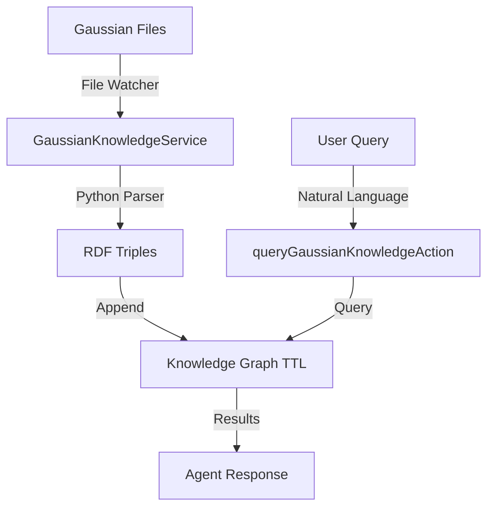

# Development Guide

This guide covers extending, modifying, and contributing to the Gaussian Knowledge Graph plugin.

## 🏗️ Architecture Overview

### Plugin Structure

```
src/plugin-gaussian-kg/
├── actions/
│   └── queryGaussianKnowledge.ts    # Natural language action handler
├── services/
│   └── gaussianKnowledgeService.ts  # Background file processing service
├── types/
│   └── eliza-core.ts               # Legacy type definitions
└── index.ts                        # Plugin configuration and exports
```

### Core Components

1. **GaussianKnowledgeService**: Background service that monitors files and maintains the knowledge graph
2. **queryGaussianKnowledgeAction**: Action that handles natural language queries
3. **Plugin Integration**: Initialization and registration with Eliza runtime

### Data Flow



## 🔧 Development Environment

### Prerequisites

```bash
# Development tools
node --version     # 18+
bun --version      # Latest
python3 --version  # 3.8+
git --version      # Any recent

# IDE with TypeScript support
code .             # VS Code (recommended)
```

### Development Setup

```bash
# Clone and setup
git clone <repository>
cd eliza-starter

# Install dependencies
bun install

# Development environment
cp .env.example .env
# Add your API keys

# Run in development mode
bun run dev  # If available, or bun start
```

### Project Structure

```
eliza-starter/
├── src/
│   ├── plugin-gaussian-kg/          # Our plugin
│   │   ├── actions/                 # Action handlers
│   │   ├── services/                # Background services
│   │   └── types/                   # Type definitions
│   ├── character.ts                 # Agent configuration
│   └── index.ts                     # Main entry point
├── py/                              # Python processing scripts
├── example_logs/                    # Test data directory
├── data/                           # Generated knowledge graphs
├── docs/                           # Documentation
└── tests/                          # Test files
```

## 🎭 Extending Actions

### Creating New Actions

```typescript
// src/plugin-gaussian-kg/actions/customAction.ts
import {
    Action,
    IAgentRuntime,
    Memory,
    State,
    HandlerCallback,
} from "@elizaos/core";

export const customGaussianAction: Action = {
    name: "CUSTOM_GAUSSIAN_ACTION",
    similes: ["CUSTOM_TRIGGER", "ALTERNATIVE_NAME"],
    validate: async (runtime: IAgentRuntime, message: Memory): Promise<boolean> => {
        const text = message.content.text?.toLowerCase() || '';
        return text.includes('custom_keyword');
    },
    description: "Custom action for specific Gaussian data analysis",
    handler: async (
        runtime: IAgentRuntime,
        message: Memory,
        state?: State,
        options?: { [key: string]: unknown },
        callback?: HandlerCallback
    ): Promise<unknown> => {
        try {
            // Get the knowledge service
            const knowledgeService = runtime.services.get("gaussian-knowledge" as any) as any;
            
            // Custom processing logic
            const result = await customProcessing(message.content.text);
            
            // Create response
            await runtime.messageManager.createMemory({
                userId: message.userId,
                agentId: message.agentId,
                content: { text: result },
                roomId: message.roomId,
            });

            if (callback) {
                await callback({ text: result });
            }

            return true;
        } catch (error) {
            console.error("Error in customGaussianAction:", error);
            return false;
        }
    },
    examples: [
        // Add example conversations
    ],
};

async function customProcessing(query: string): Promise<string> {
    // Your custom logic here
    return `Processed: ${query}`;
}
```

### Adding Actions to Plugin

```typescript
// src/plugin-gaussian-kg/index.ts
import { customGaussianAction } from "./actions/customAction.js";

const gaussianKnowledgeGraphPlugin: Plugin = {
    name: "gaussian-kg",
    description: "...",
    actions: [
        queryGaussianKnowledgeAction,
        customGaussianAction,  // Add your new action
    ],
    // ...
};
```

## 🔧 Extending Services

### Enhancing the Knowledge Service

```typescript
// src/plugin-gaussian-kg/services/gaussianKnowledgeService.ts
export class GaussianKnowledgeService extends Service {
    // Add new methods
    async getDetailedMolecularData(moleculeId: string): Promise<any> {
        try {
            const content = await fs.readFile(this.knowledgeGraphPath, 'utf-8');
            // Parse and filter for specific molecule
            return this.parseMolecularData(content, moleculeId);
        } catch (error) {
            return { error: error.message };
        }
    }

    async compareEnergies(molecule1: string, molecule2: string): Promise<any> {
        // Custom comparison logic
        const data1 = await this.getDetailedMolecularData(molecule1);
        const data2 = await this.getDetailedMolecularData(molecule2);
        
        return {
            molecule1: data1,
            molecule2: data2,
            comparison: this.calculateComparison(data1, data2)
        };
    }

    private parseMolecularData(content: string, moleculeId: string): any {
        // Implementation specific to your needs
        const lines = content.split('\n');
        // Filter and parse relevant lines
        return {};
    }

    private calculateComparison(data1: any, data2: any): any {
        // Custom comparison logic
        return {};
    }
}
```

### Creating Additional Services

```typescript
// src/plugin-gaussian-kg/services/visualizationService.ts
import { Service, IAgentRuntime } from "@elizaos/core";

export class VisualizationService extends Service {
    capabilityDescription = "Generates molecular visualizations and plots";

    async initialize(runtime: IAgentRuntime): Promise<void> {
        // Setup visualization tools
    }

    async stop(): Promise<void> {
        // Cleanup
    }

    async generateMolecularPlot(data: any): Promise<string> {
        // Generate visualization
        // Return path to generated image/plot
        return "/path/to/generated/plot.png";
    }

    async createEnergyChart(energies: number[]): Promise<string> {
        // Create energy level diagram
        return "/path/to/energy/chart.svg";
    }
}
```

## 🐍 Python Integration

### Extending Parsers

```python
# py/parse_gaussian_advanced.py
import json
import sys
import re
from typing import Dict, List, Any

def parse_advanced_properties(filepath: str, metadata: Dict) -> str:
    """
    Extended parser for additional Gaussian properties
    """
    rdf_triples = []
    
    with open(filepath, 'r') as f:
        content = f.read()
    
    # Parse additional properties
    dipole_moments = extract_dipole_moments(content)
    mulliken_charges = extract_mulliken_charges(content)
    bond_orders = extract_bond_orders(content)
    
    # Generate RDF triples
    for dipole in dipole_moments:
        rdf_triples.extend(generate_dipole_rdf(dipole, metadata))
    
    for charge in mulliken_charges:
        rdf_triples.extend(generate_charge_rdf(charge, metadata))
    
    return '\n'.join(rdf_triples)

def extract_dipole_moments(content: str) -> List[Dict]:
    """Extract dipole moment data"""
    dipole_pattern = r'Dipole moment \(field-independent basis, Debye\):\s*X=\s*([-\d.]+)\s*Y=\s*([-\d.]+)\s*Z=\s*([-\d.]+)'
    matches = re.findall(dipole_pattern, content)
    
    return [
        {
            'x': float(match[0]),
            'y': float(match[1]), 
            'z': float(match[2]),
            'magnitude': (float(match[0])**2 + float(match[1])**2 + float(match[2])**2)**0.5
        }
        for match in matches
    ]

def generate_dipole_rdf(dipole: Dict, metadata: Dict) -> List[str]:
    """Generate RDF for dipole moment data"""
    calc_id = f"ex:calculation_{metadata.get('timestamp', 'unknown')}"
    
    return [
        f"{calc_id} ontocompchem:hasDipoleMoment [",
        f"    a ontocompchem:DipoleMoment ;",
        f"    ontocompchem:hasXComponent \"{dipole['x']}\"^^xsd:double ;",
        f"    ontocompchem:hasYComponent \"{dipole['y']}\"^^xsd:double ;",
        f"    ontocompchem:hasZComponent \"{dipole['z']}\"^^xsd:double ;",
        f"    ontocompchem:hasMagnitude \"{dipole['magnitude']}\"^^xsd:double ;",
        f"] ."
    ]

if __name__ == "__main__":
    filepath = sys.argv[1]
    metadata = json.loads(sys.argv[2])
    
    result = parse_advanced_properties(filepath, metadata)
    print(result)
```

### Integrating New Parsers

```typescript
// Update processGaussianFile in gaussianKnowledgeService.ts
private async processGaussianFile(filePath: string): Promise<void> {
    try {
        // Use advanced parser for detailed analysis
        const advancedScript = path.join(process.cwd(), "py", "parse_gaussian_advanced.py");
        const { stdout: advancedRdf } = await execFileAsync("python3", [
            advancedScript,
            filePath,
            JSON.stringify(metadata)
        ]);

        // Combine with standard parsing
        const standardRdf = await this.standardParsing(filePath, metadata);
        
        const combinedRdf = standardRdf + '\n' + advancedRdf;
        await this.appendToKnowledgeGraph(combinedRdf, filePath);
        
    } catch (error) {
        console.error(`Error in advanced processing:`, error);
        // Fallback to standard processing
        await this.standardProcessing(filePath);
    }
}
```

## 📊 Data Models and Ontologies

### Extending the Ontology

```turtle
# Add new properties to your knowledge graph
@prefix custom: <https://yourproject.org/chemistry#> .

# New data types
custom:hasDipoleMoment a rdf:Property ;
    rdfs:domain ontocompchem:QuantumCalculation ;
    rdfs:range custom:DipoleMoment .

custom:DipoleMoment a rdfs:Class ;
    rdfs:subClassOf ontocompchem:MolecularProperty .

custom:hasXComponent a rdf:Property ;
    rdfs:domain custom:DipoleMoment ;
    rdfs:range xsd:double .
```

### TypeScript Interfaces

```typescript
// src/plugin-gaussian-kg/types/chemistry.ts
export interface MolecularData {
    id: string;
    scfEnergy?: number;
    homoLumoGap?: number;
    dipoleMoment?: {
        x: number;
        y: number;
        z: number;
        magnitude: number;
    };
    mullikenCharges?: AtomicCharge[];
    vibrationalFrequencies?: number[];
}

export interface AtomicCharge {
    atomIndex: number;
    element: string;
    charge: number;
}

export interface CalculationMetadata {
    filename: string;
    method: string;
    basisSet: string;
    timestamp: string;
    convergence: boolean;
}
```

## 🧪 Testing

### Unit Testing

```typescript
// tests/plugin-gaussian-kg/services/gaussianKnowledgeService.test.ts
import { describe, it, expect, beforeEach } from 'bun:test';
import { GaussianKnowledgeService } from '../../../src/plugin-gaussian-kg/services/gaussianKnowledgeService';

describe('GaussianKnowledgeService', () => {
    let service: GaussianKnowledgeService;

    beforeEach(() => {
        service = new GaussianKnowledgeService();
    });

    it('should initialize correctly', async () => {
        const mockRuntime = createMockRuntime();
        await service.initialize(mockRuntime);
        expect(service.isInitialized).toBe(true);
    });

    it('should process Gaussian files', async () => {
        const testFile = 'test_data/simple_calculation.log';
        const result = await service.processGaussianFile(testFile);
        expect(result).toBeDefined();
    });

    it('should query knowledge graph', async () => {
        const query = "show me SCF energies";
        const result = await service.queryKnowledgeGraph(query);
        expect(result.stats).toBeDefined();
        expect(result.relevantData).toBeInstanceOf(Array);
    });
});

function createMockRuntime() {
    return {
        services: new Map(),
        // ... other mock properties
    };
}
```

### Integration Testing

```typescript
// tests/plugin-gaussian-kg/integration/plugin.test.ts
import { describe, it, expect } from 'bun:test';
import { queryGaussianKnowledgeAction } from '../../../src/plugin-gaussian-kg/actions/queryGaussianKnowledge';

describe('Plugin Integration', () => {
    it('should handle end-to-end query flow', async () => {
        const mockRuntime = createMockRuntimeWithService();
        const mockMessage = createMockMessage("how many molecules?");
        
        const result = await queryGaussianKnowledgeAction.handler(
            mockRuntime,
            mockMessage
        );
        
        expect(result).toBe(true);
    });
});
```

### Test Data

```bash
# Create test data directory
mkdir -p tests/data/gaussian/

# Add sample Gaussian files
cp sample_calculations/*.log tests/data/gaussian/

# Create test knowledge graphs
cp sample_knowledge_graphs/*.ttl tests/data/
```

## 📦 Building and Distribution

### Build Configuration

```json
// package.json additions
{
  "scripts": {
    "build": "tsc",
    "dev": "tsc --watch",
    "test": "bun test",
    "lint": "eslint src/**/*.ts",
    "format": "prettier --write src/**/*.ts"
  },
  "devDependencies": {
    "@types/node": "^20.0.0",
    "eslint": "^8.0.0",
    "prettier": "^3.0.0",
    "typescript": "^5.0.0"
  }
}
```

### TypeScript Configuration

```json
// tsconfig.json for plugin development
{
  "compilerOptions": {
    "target": "ES2022",
    "module": "ESNext",
    "moduleResolution": "node",
    "strict": true,
    "esModuleInterop": true,
    "skipLibCheck": true,
    "forceConsistentCasingInFileNames": true,
    "resolveJsonModule": true,
    "allowSyntheticDefaultImports": true,
    "outDir": "./dist",
    "rootDir": "./src"
  },
  "include": ["src/**/*"],
  "exclude": ["node_modules", "dist", "tests"]
}
```

## 🚀 Deployment

### Production Configuration

```env
# .env.production
NODE_ENV=production
LOG_LEVEL=info
GAUSSIAN_PYTHON_PATH=/usr/bin/python3
GAUSSIAN_WATCH_DIR=/app/data/gaussian_logs
GAUSSIAN_DATA_DIR=/app/data/knowledge_graphs
```

### Docker Support

```dockerfile
# Dockerfile
FROM oven/bun:1 as base
WORKDIR /app

# Install Python for Gaussian processing
RUN apt-get update && apt-get install -y python3 python3-pip

# Copy dependencies
COPY package.json bun.lockb ./
RUN bun install

# Copy source code
COPY src ./src
COPY py ./py
COPY docs ./docs

# Build TypeScript
RUN bun run build

# Create data directories
RUN mkdir -p data example_logs

EXPOSE 3000
CMD ["bun", "start"]
```

## 🤝 Contributing Guidelines

### Code Style

```typescript
// Follow these conventions:

// 1. Use descriptive names
const gaussianKnowledgeService = new GaussianKnowledgeService();

// 2. Document public methods
/**
 * Processes a Gaussian log file and extracts molecular data
 * @param filePath Path to the Gaussian log file
 * @returns Promise resolving to processing results
 */
async processGaussianFile(filePath: string): Promise<ProcessingResult> {
    // Implementation
}

// 3. Handle errors gracefully
try {
    const result = await riskyOperation();
    return result;
} catch (error) {
    console.error("Operation failed:", error);
    return { error: error.message };
}

// 4. Use TypeScript types
interface ProcessingResult {
    success: boolean;
    triplesAdded: number;
    error?: string;
}
```

### Commit Messages

```bash
# Use conventional commits
git commit -m "feat: add dipole moment extraction to parser"
git commit -m "fix: handle malformed Gaussian files gracefully"
git commit -m "docs: update API reference for new actions"
git commit -m "test: add integration tests for file processing"
```

### Pull Request Process

1. **Fork** the repository
2. **Create** a feature branch: `git checkout -b feature/new-functionality`
3. **Implement** your changes with tests
4. **Update** documentation
5. **Submit** pull request with clear description

### Development Workflow

```bash
# 1. Setup development environment
git clone <repository>
cd eliza-starter
bun install

# 2. Create feature branch
git checkout -b feature/my-enhancement

# 3. Develop and test
bun run dev       # Development mode
bun test          # Run tests
bun run lint      # Check code style

# 4. Commit and push
git add .
git commit -m "feat: add new functionality"
git push origin feature/my-enhancement

# 5. Create pull request
# Use GitHub/GitLab web interface
```

---

*Ready to contribute? Start with a simple enhancement and gradually work on more complex features. Check the [API Reference](api-reference.md) for technical details.* 