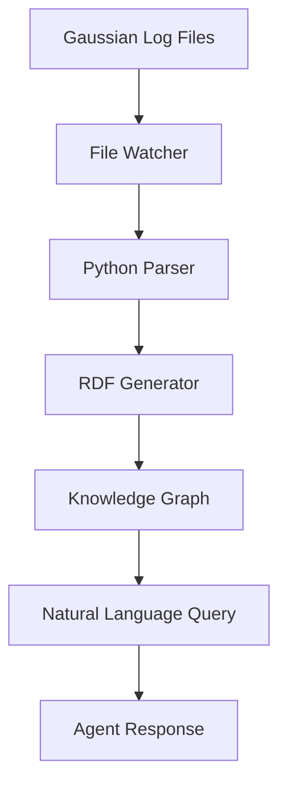

# Gaussian Knowledge Graph Plugin Overview

The Gaussian Knowledge Graph plugin transforms raw computational chemistry output files into a queryable semantic knowledge base, enabling natural language interactions with your Gaussian calculation data.

## 🎯 What It Does

The plugin automatically:
1. **Monitors** your `example_logs/` directory for new Gaussian files
2. **Parses** `.log` and `.out` files to extract chemistry data
3. **Converts** the data into semantic RDF/Turtle format
4. **Builds** a persistent knowledge graph
5. **Enables** natural language queries through the AI agent

## 🏗️ Architecture

### Core Components

```
plugin-gaussian-kg/
├── actions/
│   └── queryGaussianKnowledge.ts    # Natural language query handler
├── services/
│   └── gaussianKnowledgeService.ts  # Background file processing
├── types/
│   └── eliza-core.ts               # Type definitions (legacy)
└── index.ts                        # Plugin configuration
```

### Data Flow



## 🔧 Technical Details

### File Processing Service

The `GaussianKnowledgeService` provides:

- **Real-time Monitoring**: Uses Node.js `fs.watch()` to detect new files
- **Automatic Processing**: Invokes Python scripts to parse Gaussian output
- **RDF Generation**: Creates semantic triples in Turtle format
- **Persistent Storage**: Maintains knowledge graph in `data/gaussian-knowledge-graph.ttl`

### Query Action

The `queryGaussianKnowledgeAction` enables:

- **Natural Language Parsing**: Detects chemistry-related queries
- **Keyword Matching**: Recognizes terms like "molecules", "energies", "HOMO-LUMO"
- **Statistical Summaries**: Provides data overview and counts
- **Contextual Responses**: Returns relevant information based on user intent

### Semantic Ontology

The plugin uses established chemistry ontologies:

```turtle
@prefix cheminf: <http://semanticscience.org/resource/> .
@prefix ontocompchem: <http://www.theworldavatar.com/ontology/ontocompchem/> .
@prefix dcterms: <http://purl.org/dc/terms/> .
```

## 🎭 Actions Available

### QUERY_GAUSSIAN_KNOWLEDGE

**Triggers**: Natural language queries about computational chemistry data

**Keywords Recognized**:
- `how many`, `what`, `show me`, `find`, `search`
- `energy`, `molecule`, `calculation`, `atom`
- `homo`, `lumo`, `gap`, `frequency`
- `scf`, `dft`, `basis`, `method`
- `stats`, `statistics`, `summary`

**Example Interactions**:

```
You: "How many molecules have been analyzed?"
Agent: Returns count and summary statistics

You: "Show me SCF energies"
Agent: Lists available SCF energy data

You: "What about HOMO-LUMO gaps?"
Agent: Displays HOMO-LUMO gap information

You: "Give me the knowledge graph stats"
Agent: Shows comprehensive statistics
```

## 📊 Data Types Extracted

### Molecular Properties
- **SCF Energies**: Self-consistent field energies
- **HOMO-LUMO Gaps**: Highest/lowest orbital energy differences
- **Vibrational Frequencies**: Molecular vibration modes
- **Atomic Coordinates**: 3D molecular structure data
- **Basis Sets**: Computational method details

### Calculation Metadata
- **File Information**: Source file names and timestamps
- **Computational Methods**: DFT functionals, basis sets
- **Molecular Formulas**: Chemical composition
- **Optimization Status**: Geometry optimization results

## 🔍 Query Capabilities

### Statistical Queries
```
"How many molecules?"           → Molecule count
"Show me stats"                 → Complete statistics
"What calculations do we have?" → Calculation summary
```

### Data-Specific Queries
```
"Find SCF energies"            → Energy values
"What about frequencies?"      → Vibrational data
"Show me HOMO-LUMO gaps"       → Orbital gap data
"Tell me about atoms"          → Atomic composition
```

### File-Level Queries
```
"What's in my log file?"       → File content summary
"Process my calculations"      → Manual processing trigger
"Show recent data"             → Latest processed files
```

## 🛠️ Configuration Options

### Service Configuration

The service can be configured through environment variables:

```env
GAUSSIAN_WATCH_DIR=./example_logs     # Directory to monitor
GAUSSIAN_DATA_DIR=./data              # Output directory
GAUSSIAN_PYTHON_PATH=python3          # Python interpreter
```

### Monitoring Behavior

```typescript
// Default monitoring settings
{
    watchDirectory: "./example_logs",
    supportedExtensions: [".log", ".out"],
    processExisting: true,
    realTimeProcessing: true
}
```

## 🔬 Python Integration

The plugin relies on Python scripts for parsing:

```python
# Example structure of parse_gaussian.py
def parse_gaussian_file(filepath, metadata):
    """Extract chemistry data from Gaussian log files"""
    # Parse SCF energies, frequencies, coordinates
    # Generate RDF triples
    # Return structured data
```

## 🎯 Use Cases

### Research Workflows
- **Batch Analysis**: Process multiple calculations automatically
- **Data Mining**: Query across large sets of calculations
- **Progress Tracking**: Monitor ongoing computational work

### Educational Applications
- **Interactive Learning**: Ask questions about molecular properties
- **Data Exploration**: Understand relationships in chemistry data
- **Concept Reinforcement**: Natural language chemistry discussions

### Collaborative Science
- **Data Sharing**: Semantic format enables interoperability
- **Knowledge Preservation**: Persistent storage of calculation results
- **Cross-Platform Access**: Query data through natural language

## 🚀 Performance Characteristics

### File Processing
- **Speed**: Processes typical Gaussian files in 1-5 seconds
- **Scalability**: Handles hundreds of files efficiently
- **Memory**: Low memory footprint during processing

### Query Response
- **Latency**: Sub-second response for most queries
- **Accuracy**: High precision for statistical summaries
- **Relevance**: Context-aware result filtering

## 🔄 Integration Points

### With Eliza Core
- **Action System**: Seamlessly integrates with conversation flow
- **Memory Management**: Stores query results in conversation memory
- **Service Registry**: Properly registered as system service

### With External Tools
- **Python Scripts**: Extensible parser framework
- **RDF Tools**: Compatible with SPARQL and semantic web tools
- **File Systems**: Works with local and networked storage

## 📈 Future Enhancements

### Planned Features
- **SPARQL Endpoint**: Direct semantic queries
- **Visualization**: Molecular structure rendering
- **Advanced Analytics**: Trend analysis across calculations
- **Export Options**: Multiple output formats

### Extension Points
- **Custom Parsers**: Support for other quantum chemistry codes
- **Additional Ontologies**: Enhanced semantic richness
- **Machine Learning**: Pattern recognition in chemical data
- **Cloud Integration**: Remote processing capabilities

---

*Ready to try it? Check out the [Usage Examples](usage-examples.md) or dive into the [API Reference](api-reference.md)* 